<div align="center">


**Real-time CPU, RAM and GPU usage for every node in your ROS 2 graph — in your terminal.**

[](https://pypi.org/project/ros2top/)
[](https://pypi.org/project/ros2top/)
[](#supported-ros-2-distributions)
[](https://github.com/AhmedARadwan/ros2top/actions/workflows/ci.yml)
[](LICENSE)

```bash
pip install ros2top && ros2 top
```



</div>

---

## Why ros2top

`htop` shows you processes. `ros2 node list` shows you nodes. Neither tells you
**which node is eating your CPU** — and on a robot, that is the question. A
component container shows up in `htop` as one anonymous process at 180%, and
`ros2 node list` will not tell you which of the six nodes inside it is to blame.

ros2top maps nodes to processes and shows the numbers per node:

- **No code changes.** Nodes are discovered from the ROS graph itself. On the
  default middleware, the DDS GUID every endpoint carries encodes the PID of the
  process that owns it — enough to map a node name to a process without asking
  the node for anything.
- **Composable-node aware.** Nodes sharing a component container are grouped
  under it, with the usage reported once, for the process, because that is whose
  usage it is. No other tool makes that distinction.
- **Honest about what it knows.** An inferred PID is marked `~`. A node whose
  PID cannot be pinned down unambiguously is omitted rather than guessed at,
  because attributing another process's CPU to your node is worse than a gap.
- **`ros2 top`.** Installs as a `ros2` CLI sub-command, no ros2cli changes.

## Install

```bash
pip install ros2top
```

<details>
<summary><b>Ubuntu 24.04 and newer</b> (Jazzy, Kilted, Rolling)</summary>

The system interpreter is marked externally managed (PEP 668), so pip needs
telling:

```bash
pip install --break-system-packages ros2top
```

Or, preferably, a venv that can still see the ROS 2 packages:

```bash
python3 -m venv --system-site-packages ~/.venvs/ros2top
source ~/.venvs/ros2top/bin/activate
pip install ros2top
```

Humble (Ubuntu 22.04) needs no flag.

</details>

<details>
<summary><b>From source</b></summary>

```bash
git clone https://github.com/AhmedARadwan/ros2top.git
cd ros2top
pip install --upgrade pip     # see below
pip install -e .
```

Upgrading pip first is not optional on Ubuntu 22.04. Its pip 22.0.2 lets the
system setuptools 59.6 shadow the isolated build environment, and that
setuptools predates PEP 621 — so it ignores `[project]` entirely and installs an
empty `UNKNOWN-0.0.0` package while reporting success. `pip show ros2top`
showing `UNKNOWN` is that failure.

</details>

## Quick start

```bash
ros2top          # standalone
ros2 top         # identical, through the ros2 CLI
```

Both are the same program; ros2top registers itself with `ros2cli` through an
entry point, so `ros2 top` appears in `ros2 --help` with no changes to ros2cli.

| Option | Effect |
| --- | --- |
| `--refresh N`, `-r N` | Node refresh interval in seconds (default `0.1`) |
| `--no-auto-discovery` | Only show nodes that registered themselves |
| `--doctor` | Explain what ros2top can and cannot see, then exit |
| `--cmake-dir` | Print the path `find_package(ros2top)` needs |
| `--include-dir` | Print the C++ include path |
| `--version`, `-v` | Show version |

Not on your `PATH` after installing? `pip install --user` puts the script in
`~/.local/bin`, which some shells do not add. `python3 -m ros2top` works
regardless.

### Controls

| Key | Action | Key | Action |
| --- | --- | --- | --- |
| `q` | Quit | `↑` `↓` | Navigate nodes |
| `h` | Help | `Home` `End` | First / last node |
| `r` | Force refresh | `Tab` | Cycle panel focus |
| `p` | Pause / resume | `Space` | Force immediate update |
| `k` | Kill selected process | `+` `-` | Faster / slower refresh |

## Reading the display

```text
PID  Uptime %CPU RAM(MB) GPU# %GPU GMEM(MB) Node Name
2565 30s    0.0  23.4    --   --   --       ~/perception_container  (+2 nodes)
     30s                                      - ~/image_publisher
     30s                                      - ~/object_detector
2599 24s    1.2  55.1    --   --   --       /path_planner
2604 25s    1.2  22.2    --   --   --       /lidar_driver
```

| Column | Meaning |
| --- | --- |
| **PID** | Process hosting the node. Blank on a composed node — it shares the container's. |
| **Uptime** | Per node, not per process: a node composed into a running container is younger than the process. |
| **%CPU** | Normalised by core count, so 100% means every core saturated. |
| **RAM(MB)** | Resident set size. |
| **GPU# / %GPU / GMEM** | Device index, device utilisation, and this process's GPU memory. `--` when there is no NVIDIA GPU. |
| **Node Name** | `~` marks a PID inferred from the ROS graph rather than reported by the node. |

**`(+2 nodes)` and the indented rows** are composable nodes in one component
container. Their CPU, RAM and GPU cannot be separated — the numbers belong to
the process — so they are listed once, against the container. Killing any node
in the group ends the whole process and takes every node with it; the kill
dialog says so before it does.

## How nodes are found

To show a node's resource usage, ros2top needs its **PID**, and the ROS graph
does not publish that. Two mechanisms fill the gap.

**Automatic, no code changes.** On middleware whose DDS GUID encodes the process
id — Fast DDS, the ROS 2 default — ros2top recovers the node-to-PID mapping from
the graph alone. Rather than keep a list of which vendors work, which would rot
the moment any of them changed its layout, ros2top asks the graph where its
*own* node lives and checks whether the answer is its own PID. That proves the
capability instead of assuming it.

**Registration, always works.** A node that calls `register_node()` states its
PID directly. Required on middleware that carries no PID, such as
`rmw_zenoh_cpp` and Cyclone DDS, and more precise everywhere: registered nodes
report their own start time and can attach metadata.

The status bar says which is in play:

```text
ROS2✓ | RMW:fastrtps | Auto✓ | Nodes:8        # discovered from the graph
ROS2✓ | RMW:zenoh | Auto✗ register | Nodes:0  # registration required
```

If nothing appears, ros2top explains why in the table area rather than showing
an empty list.

## Registration API

<details open>
<summary><b>Python</b></summary>

```python
import ros2top

ros2top.register_node('/camera_processor', {
    'description': 'Processes camera feed for object detection',
    'input_topics': ['/camera/image_raw'],
    'framerate': 30,
})

ros2top.heartbeat('/camera_processor')      # optional, in your main loop
ros2top.unregister_node('/camera_processor')  # automatic on process exit
```

See [examples/python](examples/python/README.md) for a complete node.

</details>

<details>
<summary><b>C++</b></summary>

Header-only. Needs `nlohmann/json` (`sudo apt install nlohmann-json3-dev`).

```cpp
#include <ros2top/ros2top.hpp>

class MyNode : public rclcpp::Node {
public:
    MyNode() : Node("my_node"),
               // registers on construction, unregisters on destruction
               registrar_(this->get_name(), {{"version", "1.0.0"}}) {}
private:
    ros2top::AutoNodeRegistrar registrar_;
};
```

In `CMakeLists.txt`:

```cmake
find_package(ros2top REQUIRED)
target_link_libraries(my_node ros2top::ros2top)
```

ros2top is a Python wheel, so its CMake config is wherever pip put it — which is
usually not on CMake's search path. Ask it:

```bash
colcon build --cmake-args -Dros2top_DIR=$(ros2top --cmake-dir)
```

See [examples/cpp](examples/cpp/README.md) for a complete package.

</details>

Registrations live in `~/.ros2top/registry/` and are cleaned up when the process
exits.

## Supported ROS 2 distributions

Verified in the official `ros:<distro>` containers: installed with pip, then
checked for the unit suite, the `ros2 top` sub-command, and live auto-discovery
of C++, Python and composable nodes against their real PIDs.

| Distribution | Ubuntu | Default RMW | Auto-discovery | `ros2 top` |
| --- | --- | --- | --- | --- |
| **Humble** Hawksbill | 22.04 | `rmw_fastrtps_cpp` | ✅ | ✅ |
| **Jazzy** Jalisco | 24.04 | `rmw_fastrtps_cpp` | ✅ | ✅ |
| **Kilted** Kaiju | 24.04 | `rmw_fastrtps_cpp` | ✅ | ✅ |
| **Rolling** Ridley | 24.04 | `rmw_fastrtps_cpp` | ✅ | ✅ |

Iron Irwini is untested; it reached end of life in November 2024.

Auto-discovery depends on the **middleware**, not the distribution. All four
default to Fast DDS. Under `rmw_zenoh_cpp` or Cyclone DDS the graph carries no
PID, so nodes must register themselves — ros2top detects this and says so rather
than showing an empty table.

Requires Linux (CPU, RAM and PID data come from `/proc`), Python 3.8+, and
NVIDIA drivers for GPU columns.

## Troubleshooting

### Start with `ros2top --doctor`

It reports the middleware in use, self-tests auto-discovery, lists every
registry entry with the liveness of the process behind it and whether it will be
listed, resolves the C++ integration paths, and checks GPU availability. It is
plain text, meant to be pasted into an issue.

<details>
<summary><code>ros2top: command not found</code> after installing</summary>

The console script goes next to your Python, and that directory is not always on
`PATH` — `pip install --user` uses `~/.local/bin`:

```bash
export PATH="$HOME/.local/bin:$PATH"
```

Or skip `PATH` entirely: `python3 -m ros2top`.

</details>

<details>
<summary><code>ModuleNotFoundError</code> from a path inside a colcon workspace</summary>

If the traceback names a file under `<workspace>/install/ros2top/...`, a stale
colcon install of ros2top is shadowing the pip package, and it is that copy —
not the installed one — that is failing:

```bash
rm -rf <workspace>/install/ros2top <workspace>/build/ros2top
source /opt/ros/$ROS_DISTRO/setup.bash
```

</details>

<details>
<summary><code>find_package(ros2top)</code> fails in colcon</summary>

CMake searches a few system prefixes, and pip rarely installs into one:

```bash
colcon build --cmake-args -Dros2top_DIR=$(ros2top --cmake-dir)
```

</details>

<details>
<summary>A node is missing from the table</summary>

- `Auto✗ register` in the status bar — your middleware does not expose node
  PIDs (Zenoh, Cyclone). Nodes **must** call `register_node()` to appear.
- `Auto✓` but a node is missing — confirm it with `ros2 node list`. Nodes on
  other machines are skipped deliberately: their PID is meaningless locally. A
  node is also skipped when its PID cannot be pinned down unambiguously.
- `rclpy is not importable` — ROS 2 is not sourced, so the graph cannot be
  read. Source it, or use registration.
- Nodes running in a **container** while ros2top runs on the host (or the
  reverse) are invisible: the PIDs belong to different namespaces. Share the
  host PID namespace (`--pid=host`) and mount `~/.ros2top/registry`.

</details>

<details>
<summary>No GPU columns</summary>

- Install NVIDIA drivers, and `pip install pynvml`.
- On **Jetson** this is expected: NVML does not support the integrated GPU, so
  per-process GPU accounting is unavailable. See
  [#2](https://github.com/AhmedARadwan/ros2top/issues/2).

</details>

## Development

```bash
git clone https://github.com/AhmedARadwan/ros2top.git
cd ros2top
pip install --upgrade pip && pip install -e . pytest
python -m pytest tests/ -q
```

CI runs the unit suite on Python 3.8–3.13, and builds and runs the C++ example
in the official `ros:humble`, `jazzy`, `kilted` and `rolling` containers,
asserting on the registry it produces.

<details>
<summary>Layout</summary>

```text
ros2top/
├── ros2top/
│   ├── main.py            # CLI entry point
│   ├── node_monitor.py    # core monitoring logic
│   ├── node_registry.py   # registration system (shared with C++)
│   ├── graph_discovery.py # node -> PID from the ROS graph
│   ├── gpu_monitor.py     # NVML
│   ├── doctor.py          # ros2top --doctor
│   ├── paths.py           # locating the C++ integration files
│   ├── command/top.py     # ros2cli plugin for `ros2 top`
│   └── ui/                # curses interface
├── include/ros2top/ros2top.hpp   # header-only C++ API
├── cmake/                 # ros2topConfig.cmake
├── examples/{python,cpp}/  tests/  assets/
```

</details>

## Contributing

Issues and pull requests are welcome. Please include `ros2top --doctor` output
in bug reports — it usually contains the answer.

## Changelog

See [CHANGELOG.md](CHANGELOG.md).

## Similar tools

`htop` (processes) · `nvtop` (GPU processes) · `ros2 node list` (node names) ·
`ros2 topic hz` (topic rates)

## License

MIT — see [LICENSE](LICENSE).
